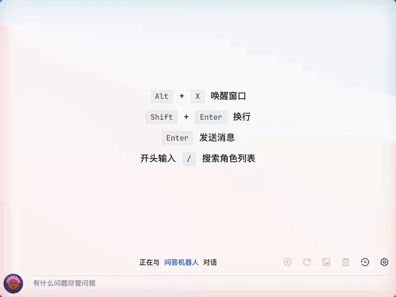
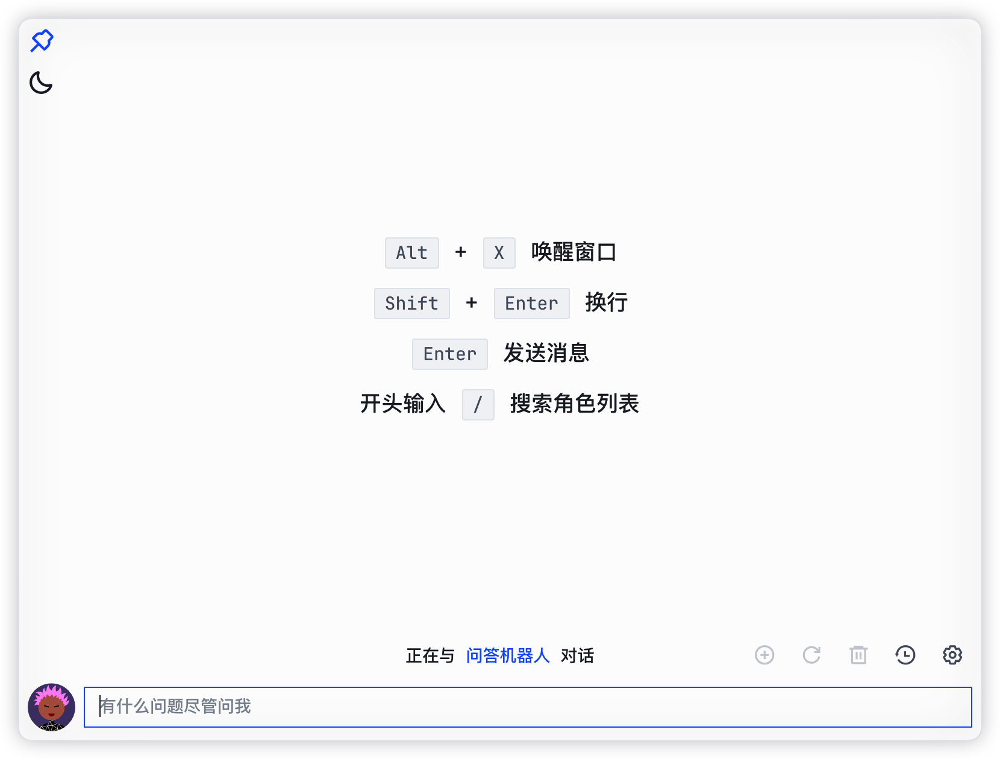
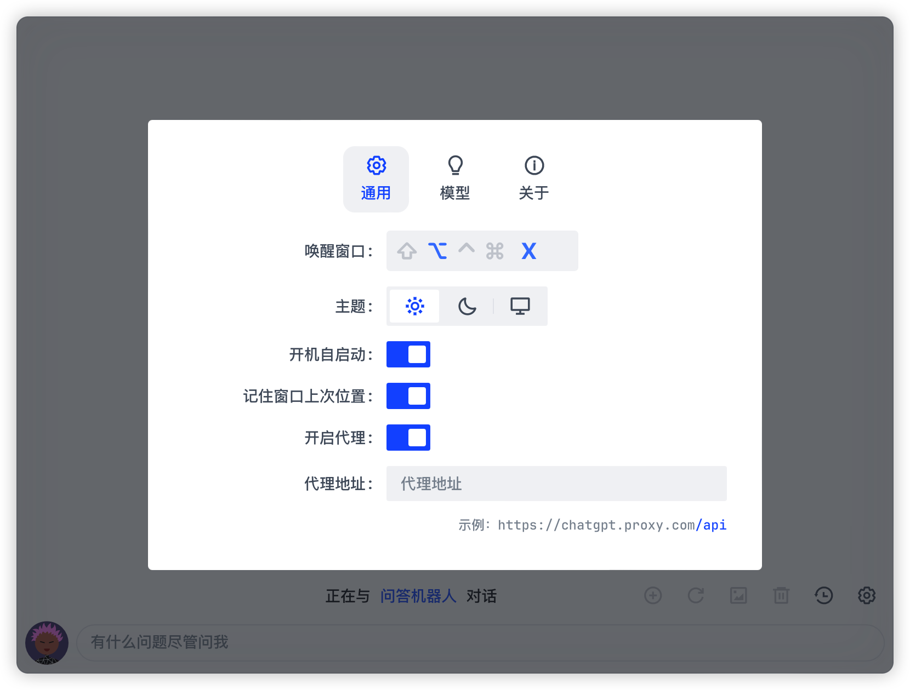
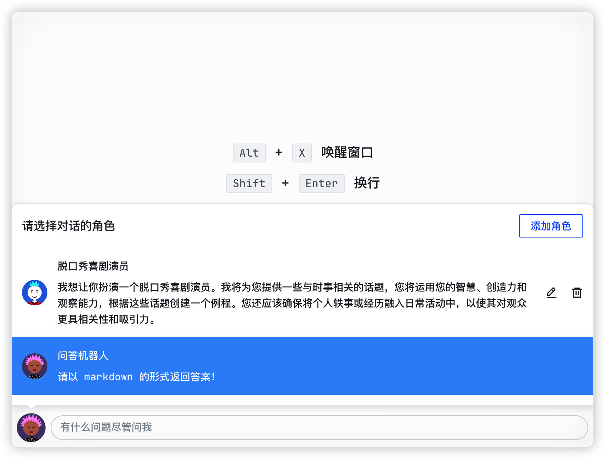
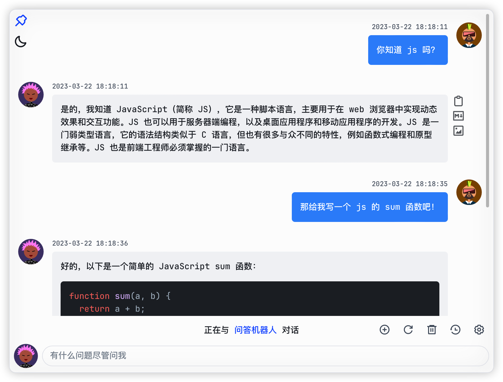
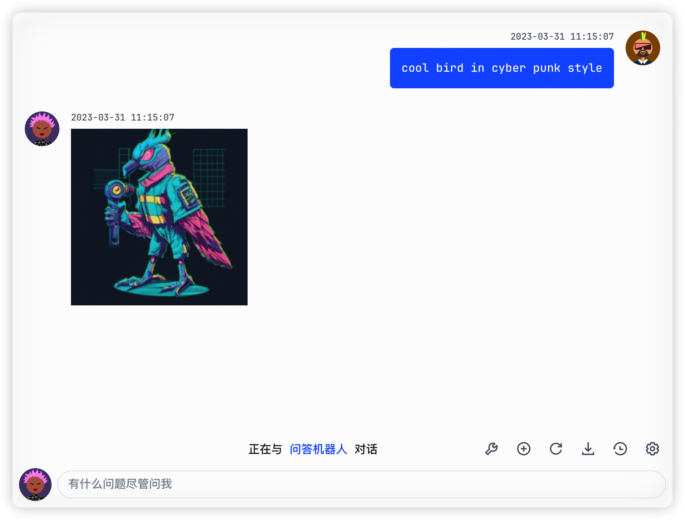
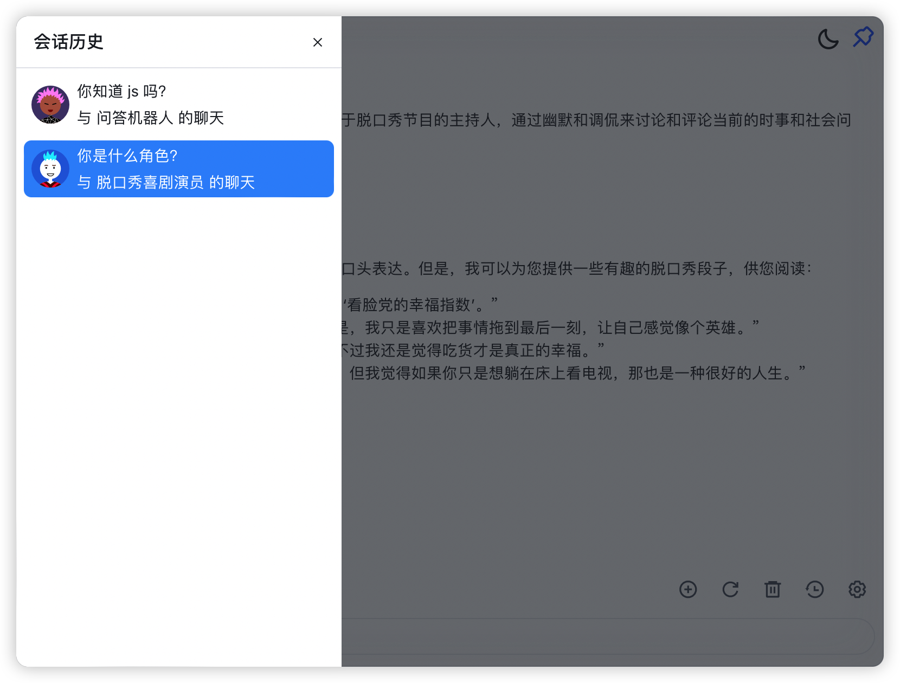
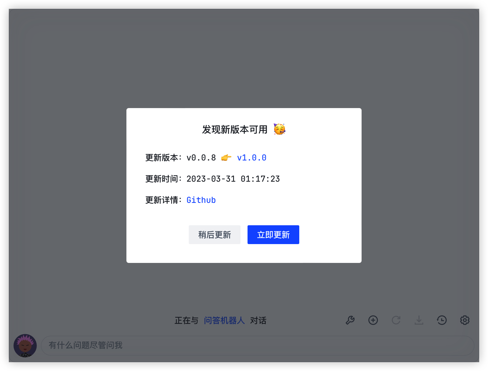

<a href="https://github.com/Synaptrix/ChatGPT-Desktop">
  
</a>

<div align=center>
  <br/>
  <div>
     中文 | <a href="https://github.com/Synaptrix/ChatGPT-Desktop">English</a>
  </div>
  <br/>

  <div>
    <a href="https://github.com/Synaptrix/ChatGPT-Desktop/releases/latest">
      
    </a>
    <a href="https://github.com/Synaptrix/ChatGPT-Desktop/releases/latest">
      
    </a>
    <a href="https://github.com/Synaptrix/ChatGPT-Desktop/releases/latest">
      
    </a>
  </div>

  <div>
    
    
    
  </div>

   <h3>注意：软件本身不提供 API KEY，需要自行准备</h3>
</div>

## 为什么选择 ChatGPT-Desktop？

当今社会，智能化、便捷化已经成为趋势。选择 ChatGPT-Desktop，您将享受到以下优势：

- 我们使用 tauri 构建项目，使项目包更加小巧精简，资源占用更少，同时适配多个平台。

- 我们提供了配置代理的功能，您可以通过设置代理来实现更加灵活的网络访问。

- 可以选择让 app 常驻后台，快捷键(支持自定义)一键唤醒，节省时间，提高效率。

- 支持多对话，利用 GPT-3.5-turbo 的最新特性，配合记忆模式，随时继续上一次对话。

- 更便捷的管理和调试 prompt 预设，构建你自己的角色预设库，使得对话更加个性化。

- 内置丰富的导出功能，更加便利的分享结果！

- 软件支持自动更新和手动检查更新的功能，以便大家更方便地更新软件。

- 将所有对话存储到本地，方便随时查阅，留在身边最安心。

- 更多的好玩的功能，有待与你一起探索...

## 下载

- **Mac**: [Apple Silicon](https://github.com/ChatGPT-Desktop/ChatGPT-Desktop/releases/download/v1.0.0/ChatGPT-Desktop_1.0.0_aarch64.dmg) 或者 [Intel](https://github.com/ChatGPT-Desktop/ChatGPT-Desktop/releases/download/v1.0.0/ChatGPT-Desktop_1.0.0_x64.dmg)
- **Windows**: [全平台](https://github.com/ChatGPT-Desktop/ChatGPT-Desktop/releases/download/v1.0.0/ChatGPT-Desktop_1.0.0_x64_zh-CN.msi)
- **Linux**: [全平台](https://github.com/ChatGPT-Desktop/ChatGPT-Desktop/releases/download/v1.0.0/chat-gpt-desktop_1.0.0_amd64.deb)



## 软件截图

<details>
<summary>查看详情</summary>








</details>

## 常见问题

<details>
<summary>1. 我所在的地区有网络限制，怎么正常使用？</summary>

可以使用我们提供的[解决方案](https://github.com/ChatGPT-Desktop/ChatGPT-Desktop-Porxy)

详细部署教程：[Discord](https://discord.com/channels/1074429768063262791/1090723974650015857)

</details>

<details>
<summary>2. MacOS 提示 app 已损坏，无法打开。</summary>


参考 huazai 大佬的[解决办法](https://zhuanlan.zhihu.com/p/135948430)

</details>

## 如何贡献

### 项目依赖

- [Rust 环境](https://tauri.app/v1/guides/getting-started/prerequisites/): 请自行根据官网步骤安装 rust 环境
- [Node.js](https://nodejs.org/en/): 用于运行项目

#### 下载依赖

```shell
npm install
```

#### 启动应用

```shell
npm run tauri dev
```

#### 打包应用

##### 如果需要打包后进行调试，请在以下命令后面加上 `--debug`

```shell
npm run tauri build
```

#### 生成应用图标，请自行替换`src-tauri/assets/icon.png` 文件，仅支持 `png` 格式

```shell
npm run build:icon
```

#### 也可以使用 `yarn` 或者 `pnpm` 等等...

欢迎任何形式的贡献，包括但不限于：

- 提交 Issue
- 提交 Pull request
- 提交 Feature request
- 提交 Bug report
- 提交文档校订
- 提交其他任何形式的贡献

## Contact

- [Discord](https://discord.gg/jg4waryfA6)

## Star History

[](https://star-history.com/#Synaptrix/ChatGPT-Desktop&Date)

## Contributors

<a href="https://github.com/Synaptrix/ChatGPT-Desktop/graphs/contributors">
  
</a>

## License

[MIT License](./LICENSE)
