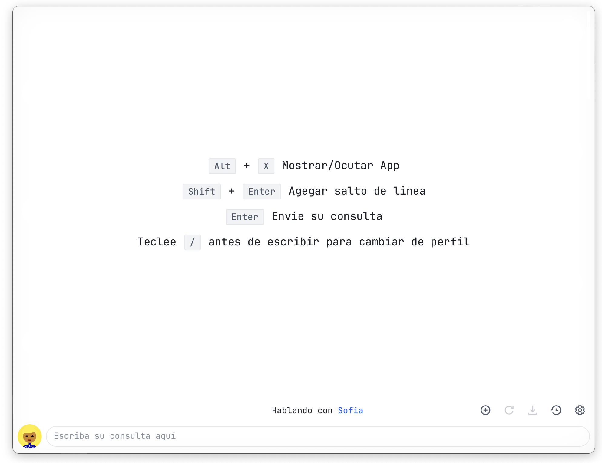
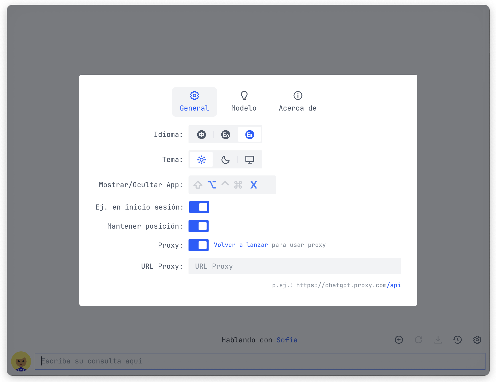
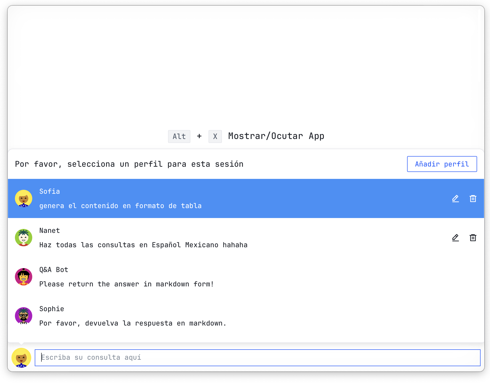
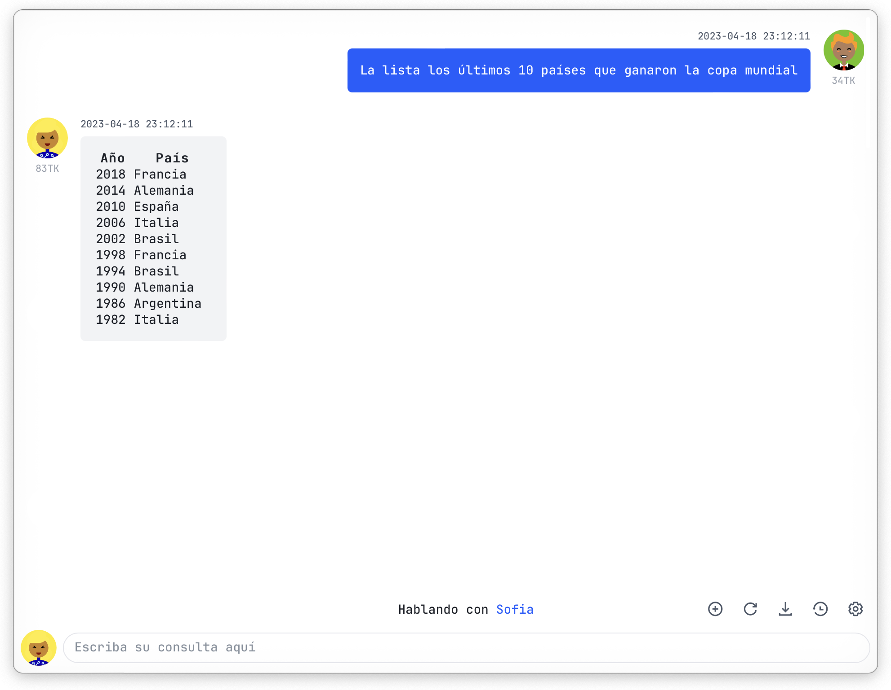
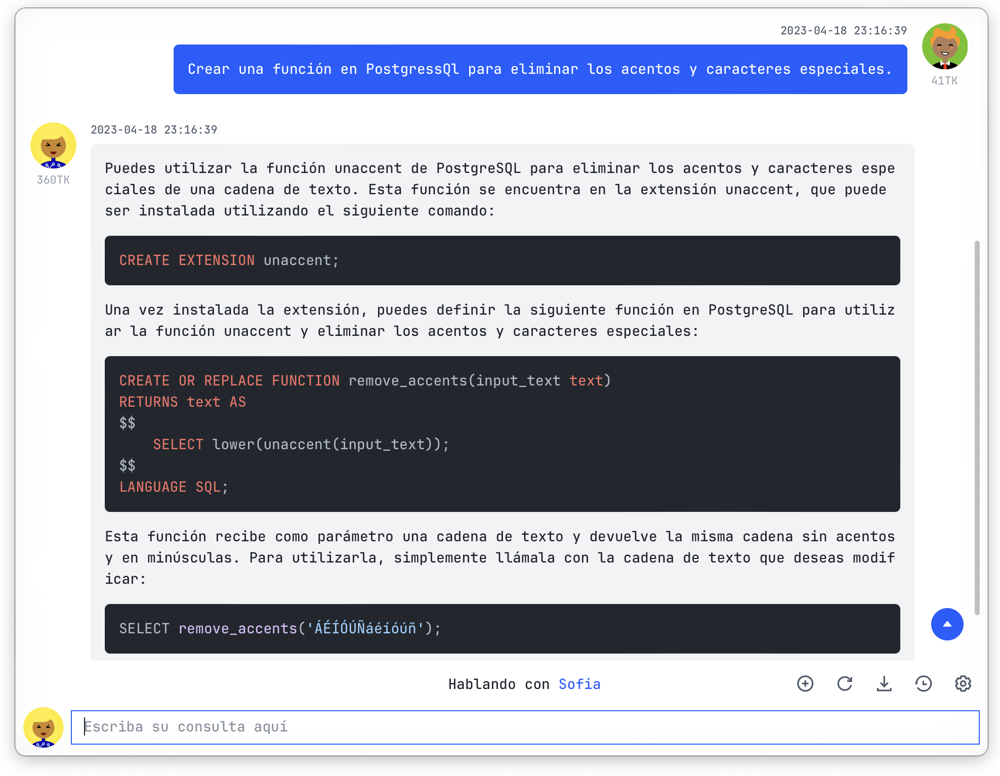
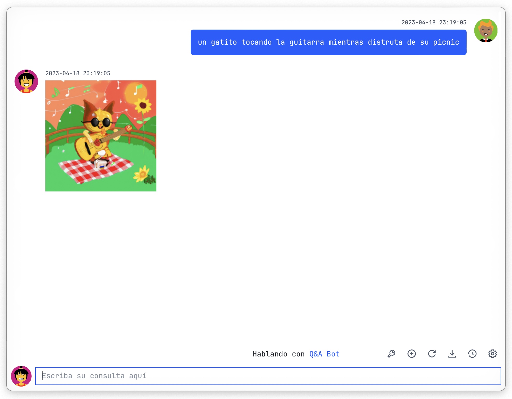
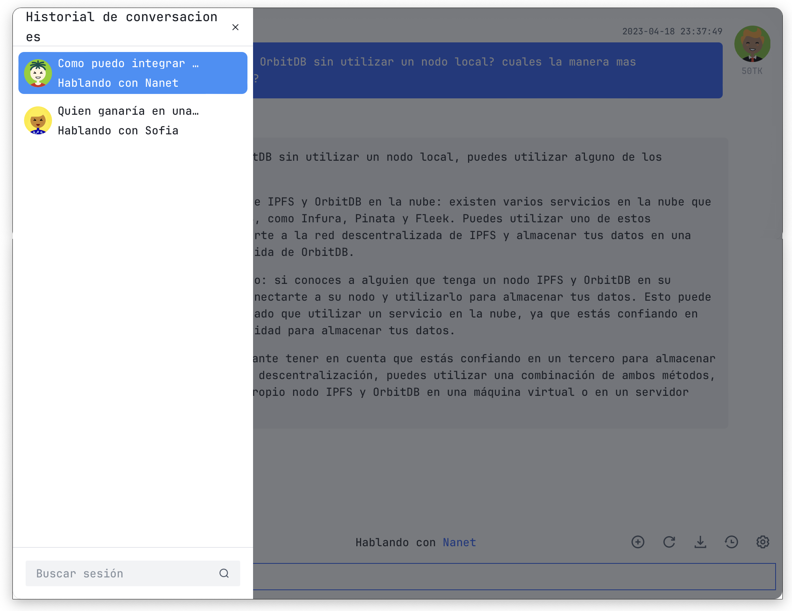
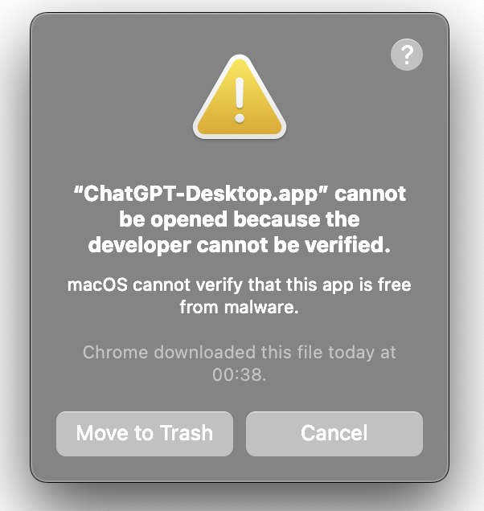

<a href="https://github.com/Synaptrix/ChatGPT-Desktop">
  
</a>

<div align=center>
  <br/>
  <div>
      <a href="https://github.com/Synaptrix/ChatGPT-Desktop">English</a> | <a href="./README-CN.md">中文</a> | Español
  </div>
  <br/>

  <div>
    <a href="https://github.com/Synaptrix/ChatGPT-Desktop/releases/latest">
      
    </a>
    <a href="https://github.com/Synaptrix/ChatGPT-Desktop/releases/latest">
      
    </a>
    <a href="https://github.com/Synaptrix/ChatGPT-Desktop/releases/latest">
      
    </a>
  </div>

  <div>
    
    
    
  </div>
</div>

## Características

- Soporte para múltiples plataformas, uso mínimo de recursos, ideal para uso 24/7.

- Proxy fácilmente configurable, elude las restricciones de red con facilidad.

- Activar en cualquier momento con una tecla de acceso directo personalizable, Acelera tu productividad!

- Soporte para múltiples conversaciones, integrado con el modo de memoria `GPT-3.5-turbo`, nunca olvide lo que ha dicho.

- Robusta gestión de instrucciones, construye tu propia biblioteca de roles preestablecidos.

- Comparta sus momentos con solo un clic.

- Actualizaciones automáticas, almacenamiento de historial de conversación localmente, su privacidad es nuestra prioridad.

- Y mucho más para explorar...

## Descargar

Plataformas compatibles:

- **MacOS**: [Apple Silicon](https://github.com/ChatGPT-Desktop/ChatGPT-Desktop/releases/download/v1.0.1/ChatGPT-Desktop_1.0.1_aarch64.dmg) | [Intel](https://github.com/ChatGPT-Desktop/ChatGPT-Desktop/releases/download/v1.0.1/ChatGPT-Desktop_1.0.1_x64.dmg)
- **Windows**: [Windows](https://github.com/ChatGPT-Desktop/ChatGPT-Desktop/releases/download/v1.0.1/ChatGPT-Desktop_1.0.1_x64_zh-CN.msi)
- **Linux**: [Linux](https://github.com/ChatGPT-Desktop/ChatGPT-Desktop/releases/download/v1.0.1/chat-gpt-desktop_1.0.1_amd64.deb)


## Capturas de pantalla

<details>
<summary>Expandir para ver listado</summary>








</details>

## Preguntas y respuestas

<details>
<summary>1. Hay restricciones de red en mi área, ¿cómo puedo usarlo correctamente</summary>

Puede probar nuestra [solución](https://github.com/ChatGPT-Desktop/ChatGPT-Desktop-Porxy) proporcionada.

Tutorial de implementación detallado en [Discord](https://discord.com/channels/1074429768063262791/1090723974650015857).

</details>

<details>
<summary>2. "La aplicación está dañada y no se puede abrir" en MacOS</summary>


Referencia [solución](https://zhuanlan.zhihu.com/p/135948430).

</details>

## Cómo contribuir

#### Requisitos del entorno de desarrollo

Por favor, instale `Rust` y `NodeJS` de acuerdo con los pasos en los sitios web oficiales.

- [Rust](https://tauri.app/v1/guides/getting-started/prerequisites/)
- [Node.js](https://nodejs.org/en/)

#### Descargar las dependencias del proyecto

```shell
npm install
```

#### Ejecutar el proyecto en modo de desarrollo

```shell
npm run tauri dev
```

#### Compilar el proyecto

Para depurar después de la compilación, agregue el flag/parámetro `--debug`

```shell
npm run tauri build
```

#### Para generar su propio icono de aplicación, reemplace `src-tauri/assets/icon.png`, solo se admite el formato `.png`

```shell
npm run build:icon
```

También se admite `yarn` O `pnpm`.

### Se agradecen las contribuciones de cualquier tipo :

- Problemas
- Pull requests / Solicitudes de extracción
- Solicitud de mejoras
- Informe de errores
- Documentación
- Traducción
- etc.

## Contáctenos

- [Discord](https://discord.gg/jg4waryfA6)

## Estadísticas

[](https://star-history.com/#Synaptrix/ChatGPT-Desktop&Date)

## Contribuidores

<a href="https://github.com/Synaptrix/ChatGPT-Desktop/graphs/contributors">
  
</a>

## Licencia

[MIT License](./LICENSE)
